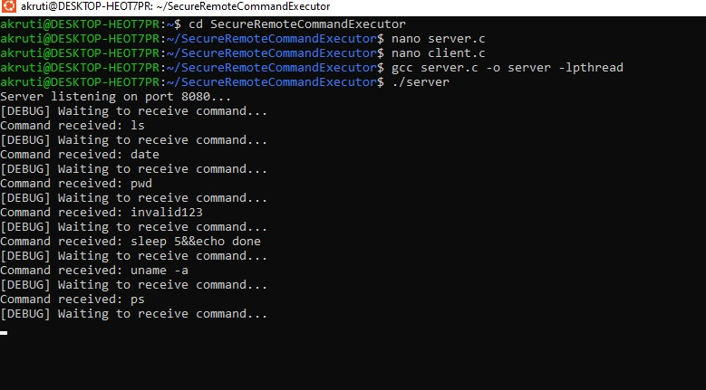
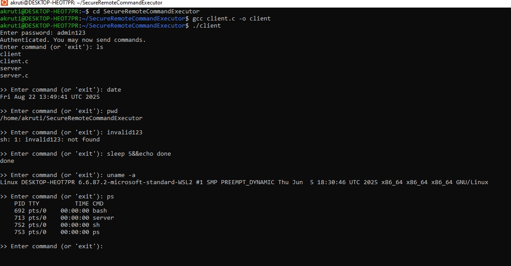

SecureRemoteControlExecutor

## Description
A **TCP-based client-server application** that allows secure remote command execution with **basic authentication**. It demonstrates key **Linux concepts** such as socket programming, process management, multithreading, inter-process communication, and file system operations.

## How It Works
1. The **server** starts and listens for incoming TCP client connections.  
2. The **client** connects to the server and sends login credentials.  
3. Upon **successful authentication**, the client can send commands to the server.  
4. The **server executes the commands** on its system and returns the output to the client.  
5. This process demonstrates **Linux concepts** like socket programming, process management, multithreading, IPC, and file system operations.

## Screenshots

## Learning Outcomes
- Understanding TCP socket programming  
- Implementing basic client-server authentication  
- Working with Linux processes and scheduling  
- Using multithreading and inter-process communication (IPC)  
- File system operations in Linux
